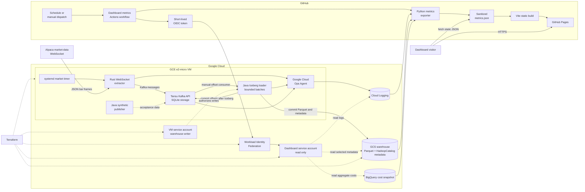

# End-to-End Architecture

The production path has one writer to the raw Iceberg table. Market frames flow through the
VM, while a separate read-only GitHub Actions path publishes sanitized operational metrics.

## Runtime Guarantees and Boundaries

- The extractor preserves each Alpaca WebSocket frame as one Kafka message.
- The loader writes bounded batches directly with Iceberg Java APIs; Spark is not in the write
  path. Kafka offsets advance only after the associated Iceberg commit succeeds.
- HadoopCatalog has one writer on the VM. `flock` and systemd prevent concurrent loader
  processes; `payload_hash` makes at-least-once replays identifiable downstream.
- The VM service account can write the warehouse. The dashboard identity is short-lived and
  can read only Cloud Logging, selected Iceberg metadata, and aggregate cost data.
- GitHub Pages is static. Browsers receive the Vite bundle and sanitized `metrics.json`; they
  never connect to GCP or receive cloud credentials.

For operating details, see the [VM services](runbooks/vm-services.md), [public dashboard](runbooks/public-dashboard.md), and [WIF authentication](github-actions-wif-auth-flow.md) guides.
