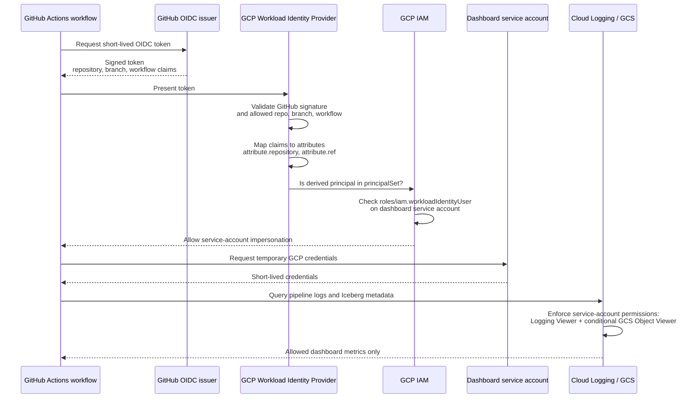

# GitHub Actions to GCP authentication flow

The public dashboard uses GitHub OpenID Connect (OIDC) and Google Cloud
Workload Identity Federation (WIF). It does not store a GCP service-account
key in GitHub.



## What each piece does

1. **GitHub OIDC token**: a signed, short-lived statement that identifies the
   running workflow, including its repository, branch, and workflow file.
2. **Workload Identity Provider**: validates that token and maps claims into
   GCP attributes such as `attribute.repository`.
3. **Federated principal**: a temporary GCP identity derived from those mapped
   attributes. It is not a stored user or service account.
4. **Principal set**: an IAM selector for matching temporary principals. For
   example, this selects tokens from this repository:

   ```text
   principalSet://iam.googleapis.com/POOL_NAME/attribute.repository/Srutakirti/alpaca-streaming-lakehouse
   ```

5. **`roles/iam.workloadIdentityUser`**: granted on the dashboard service
   account to that principal set. It allows matching GitHub workflow identities
   to impersonate the service account.
6. **Service-account roles**: determine the resulting credentials' real data
   access. The dashboard account has `roles/logging.viewer` and a conditional
   `roles/storage.objectViewer` binding limited to the configured Iceberg
   metadata directory.

In short:

```text
GitHub token claims → mapped GCP attributes → temporary principal
→ workloadIdentityUser permission → dashboard service account
→ narrowly scoped log and metadata reads
```
